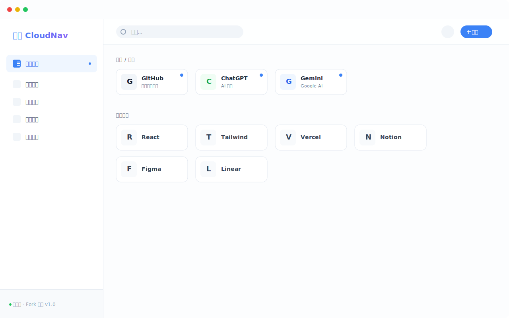
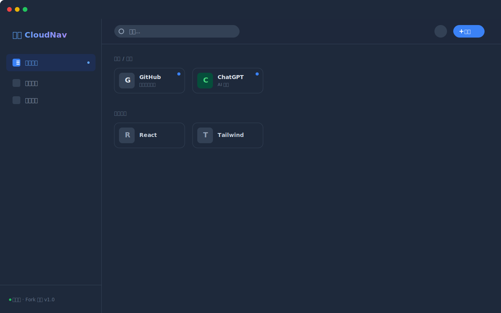

# CloudNav-abcd（修改版）
**本项目基于在大佬 https://github.com/sese972010/CloudNav- 的项目上，根据我的个性化需求做了一些修改，设置密码后需要输密访问，适合个人使用！**

---
最新版本v1.7
- 1、同步更新设置页面的界面和功能
- 2、同步升级浏览器扩展工具浏览器插件（功能提升）
- 3、新增带有时间戳的WebDAV双重备份功能
- 4、调整鼠标悬浮和排序状态下的站点卡片背景颜色
- 5、新增链接编辑页面网址图标实时预览效果

---

<strong>👉 点击查看更新记录</strong>

版本v1.6
- 1、站外搜索网站的设置保存到服务器实现持久化
- 2、分类目录权限部分修改：`常用推荐`分类调整为可以移动位置，修改和删除存量分类需要再次输入访问密码授权
- 3、默认访问密码一周过期，可以在左下角网站设置页面修改过期时间

版本 v1.5.1:优化手机端访问时，顶部菜单栏搜索样式和功能

版本 v1.5
更新内容：
- 增加站外搜索功能，可以配置多个站外搜索网站，同时可以点击搜索框左侧的图标弹出下拉框切换站外搜索网站

版本V1.4
更新内容：
- 1、右键菜单：当将鼠标移动到站点卡片后，可以点击鼠标右键调出右键菜单，右键菜单支持：复制链接、显示二维码、编辑链接、删除链接等快捷操作。
- 2、增加简约版和详情版的站点卡片样式切换

版本V1.3
更新内容：
- 1、修复移动端访问没有退出按钮
- 2、增加首次批量添加站点信息不关窗口开关，增加效率
- 3、分类名称旁增加该分类站点卡片数量
- 4、修复自定义网站名称不被版本升级重置
- 5、站点图标缓存优化

版本V1.2
更新内容：
- 1、解决站点卡片标题文字超出卡片边框的问题
- 2、批量编辑增加全选功能
- 3、在某个分类下新增新链接自动默认归属到当前分类
- 4、添加新站点增加自动获取网站图标的功能
- 5、WebDAV备份增加InfiniCloud网盘
- 6、增加退出功能，非私有电脑保护隐私
- 7、Chrome 扩展菜单改为中文

版本V1.1
更新内容：
- `批量编辑`增加批量删除和批量移动站点卡片
- 修复删除分类目录后没有“常用推荐”的问题
- 添加新站点网址自动补全 https://

---
## 修改内容
#### 一、编辑链接增加自动获取图标功能
填写网址后，点击`自动获取图标`按钮

<strong>👉 点击查看截图</strong>

#### 二、站点卡片支持拖拽排序

<strong>👉 点击查看截图</strong>

#### 三、导入导出增加 JSON 文件

<strong>👉 点击查看截图</strong>

#### 四、设置页面增加修改网站名称

<strong>👉 点击查看截图</strong>

#### 五、分类站点增加自定义图标功能

<strong>👉 点击查看截图</strong>

---

# CloudNav (云航) - 智能私有导航站

 

<!-- 请将下方的链接替换为您实际部署后的 Cloudflare Pages 域名 -->

 

**一个现代化、基于 AI 辅助的全栈个人导航站。**
**无需购买服务器，依托 Cloudflare 免费托管，实现多端数据实时同步。**

[在线演示](https://cloudnav.yy77.eu.org) • [功能特性](#-核心功能) • [项目展示](#-项目展示) • [部署教程](#-部署教程-免费) • [使用指南](#-使用指南)

---

<strong>👉 点击查看项目功能介绍</strong>

## ✨ 核心功能

### 🧠 AI 深度集成
*   **多模型支持**: 完美支持 **Google Gemini**、**OpenAI**、**DeepSeek**、**Claude** 等任何兼容 OpenAI 接口的模型。
*   **一键智能补全**: 在设置面板一键扫描，自动为成百上千个书签生成精准的中文简介。
*   **智能分类**: 添加链接时，AI 自动分析网页内容并推荐最合适的分类目录。

### ☁️ 数据同步与安全
*   **Cloudflare KV 同步**: 利用边缘存储技术，公司、家里、手机三端数据秒级同步。
*   **WebDAV 双重备份**: 支持坚果云、Nextcloud 等 WebDAV 网盘备份，数据自主掌控。
*   **隐私加密体系**:
    *   **全局锁**: 部署时设置访问密码，防止他人查看。
    *   **目录锁**: 支持对“私有资源”等特定分类单独设置密码，隐藏敏感内容。

### 🎨 极致体验
*   **Chrome 扩展插件**: 提供官方代码生成，支持点击浏览器图标后**手动选择分类**保存，体验媲美原生。
*   **置顶专区**: 常用网站一键置顶，在首页顶部常驻显示。
*   **无缝迁移**: 支持导入 Chrome/Edge 书签 HTML 文件（智能去重）。

---

## 📸 项目展示

> 以下为 CloudNav 的实际运行界面预览。

### 🖥️ 桌面端概览
| 浅色模式 (Light Mode) | 深色模式 (Dark Mode) |
| :---: | :---: |
|  |  |
| *清爽明亮的日间视图* | *护眼沉浸的夜间视图* |

### 🛠️ 核心功能演示
| AI 智能设置 | 分类加密锁 | 移动端适配 |
| :---: | :---: | :---: |
|  |  |  |
| *一键批量生成描述* | *私密目录密码保护* | *完美适配手机浏览器* |

*(注：上方使用了项目生成的 SVG 矢量预览图，代表实际 UI 布局)*

---

## 🚀 部署教程 (免费)

本应用完全基于 **Cloudflare Pages** + **KV** 构建，无需服务器，永久免费。

> **📥 [点击下载完整图文教程 (.docx)](图文教程.docx)**

### 📋 简明部署步骤 (适合有经验用户)

1.  **Fork 项目**: 点击右上角 Fork 按钮，将本项目克隆到您的 GitHub 账号。
2.  **创建 Pages 应用**: 登录 Cloudflare Dashboard -> Workers & Pages -> 创建应用程序 -> Pages -> 连接到 Git -> 选择 `CloudNav-abcd`
3.  **配置构建**:
    *   框架预设: **无 (None)**
    *   构建命令: `npm run build`
    *   输出目录: `dist`
4.  **创建数据库**: 在 Workers & Pages -> KV 中创建一个新的命名空间，命名为 `CLOUDNAV_DB`
5.  **绑定变量**:
    *   进入 Pages 项目设置 -> 绑定 (Bindings) -> 添加 KV 命名空间 -> 变量名填 `CLOUDNAV_KV`，值选择刚才创建的 `CLOUDNAV_DB`
    *   进入 环境变量 (Environment variables) -> 添加变量 `PASSWORD`，值为您的访问密码。
6.  **部署**: 重新部署项目即可。

---

<strong>👉 点击查看部署方法（图文教程）</strong>

### 📖 保姆级图文教程 (适合新手)

> 如果您是第一次使用 Cloudflare，请严格按照以下步骤操作。

#### 第一步：点击创建应用程序

#### 第二步：点击右下角 Get started

#### 第三步：导入现有你已经 fork 的仓库

#### 第四步：这里选你自己 fork 的仓库名称

#### 第五步：按图中填写，其他默认

#### 第六步：左侧找到 Workers KV 点击右侧新建

#### 第七步：空间名称填写 `CLOUDNAV_DB`（建议复制）

#### 第八步：绑定 KV 数据库
回到刚才的 pages 设置页面找到绑定-右侧下滑找到 kv 命名空间，变量名称填写 `CLOUDNAV_KV`（建议复制）

#### 第九步：设置访问密码
设置中找到变量和机密-填入 `PASSWORD`（建议复制）下面的值填入你自己要设置的密码，这一步是你登录导航页需要的登录密码

#### 第十步：添加自定义域名（可选项）

**🎉 所有设置结束后，请务必到部署页面点击“重新部署” (Create New Deployment)，项目即可正常使用！**

---

<strong>👉 点击查看使用指南</strong>

## ⚙️ 使用指南

### 1. Chrome 扩展程序 (推荐)
点击侧边栏左下角的 **“设置”** -> **“扩展工具”**。
系统会自动根据您的域名生成 3 个文件代码 (`manifest.json`, `popup.html`, `popup.js`)。
1. 在电脑新建文件夹，保存这 3 个文件。
2. 打开 Chrome 扩展管理页 (`chrome://extensions`)。
3. 开启右上角 **“开发者模式”**。
4. 点击 **“加载已解压的扩展程序”**，选择刚才的文件夹。
5. 以后浏览网页时，点击插件图标即可弹出窗口，**选择分类并保存**。

### 2. 配置 AI 服务
点击侧边栏底部的 **“设置”** -> **“AI 设置”**：
*   **提供商**: Google Gemini 或 OpenAI 兼容 (DeepSeek等)。
*   **Key & Model**: 输入 API Key 和模型名称。
*   **一键补全**: 点击底部的 **“一键补全所有描述”**，AI 将自动扫描所有无描述的链接并后台生成。

### 3. WebDAV 备份
点击侧边栏的 **“备份”** 图标，配置 WebDAV 信息 (如坚果云)，即可一键上传备份到云端。

### 4. 本地数据导出 (Local Data Export)
点击侧边栏的 **“备份”** 图标 -> **“导出 HTML”**。
*   生成的 HTML 文件完全兼容 **Chrome**、**Edge**、**Firefox** 等主流浏览器的导入格式。
*   完整保留您在云航中整理的分类目录结构。

**如何导入到浏览器 (以 Chrome 为例):**
1. 打开 Chrome 浏览器，点击右上角菜单 -> **书签与清单** -> **书签管理器**。
2. 点击页面右上角的三个点图标 -> **导入书签**。
3. 选择刚才从云航下载的 HTML 文件即可恢复所有书签。

---

**如果您觉得项目不错，希望给本项目点一个免费的 Star ⭐️，感谢您的关注！**

**如果有 Bug 或改进的地方，请在 Issue 中提交您的建议。**

 

Made with ❤️ by CloudNav Team

